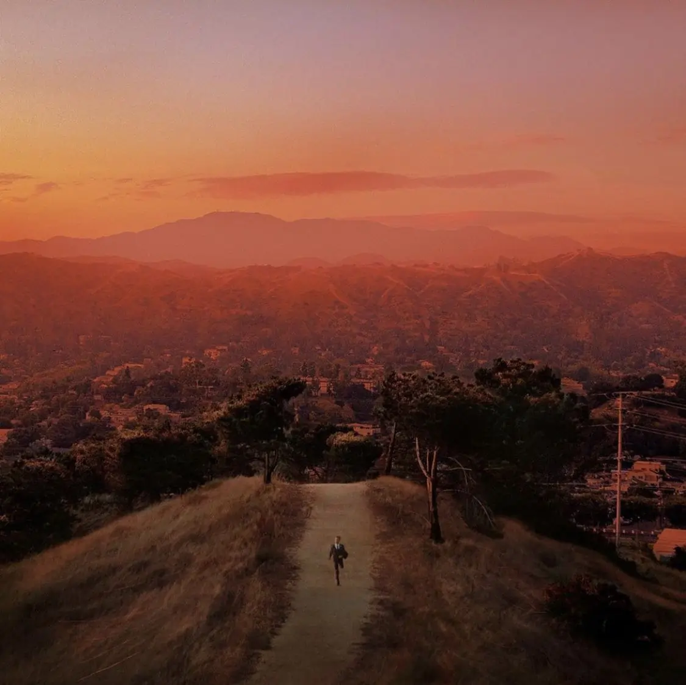

I've listening to Blood Harmony constantly for over a week now. It's one of the greatest work of Finneas. For those who don't recognise, **Blood Harmony** is the debut EP by Finneas, and he is the brother of Billie Eilish. It was released in October 2019. It has 7 tracks:

1. _"I Lost a Friend"_
2. _"Shelter"_
3. _"Lost My Mind"_
4. _"I Don't Miss You at All"_
5. _"Partners in Crime"_
6. _"Let's Fall in Love for the Night"_
7. _"Die Alone"_

With this, I'm starting a monthly series where I'll share an album or EP I care about the most and discuss its tracks and theme.

I first heard it around the fall of 2021, though. Since then, at the start of every fall, either _'Lost My Mind'_ or _'Let's Fall in Love for the Night'_ seems to resurface. This year, the flavors lingered longer than usual. So, why not share the taste with everyone?

Everything I discuss will be my personal opinions and interpretations of the EP and its tracks.

If this EP could be defined in one word, it would be _'hopeless romantic.'_ The tracks explore themes of turmoil caused by feelings of separation, yearning, missing love, insanity, and cherished old memories. A sense of empty void can be infered from the lyrics like

> There's an empty space beside me, And I'll keep it that way until you're here, I need you here

Even I adore the veiled lonliness portrayed in the tracks. This particular EP was the culmination of Finneas's works from the past and various other projects. Yet every track adheres perfectly to the theme of the album.

The consecutive tracks display opposites. _"I Lost a Friend"_, _"Lost My Mind"_ and _"Die Alone"_ explore the grief of loss, sanity and will, respectively. While, _"Shelter"_, _"I Don't Miss You at All"_, _"Partners in Crime"_ and _"Let's Fall in Love for the Night"_ are more upbeat and promising songs. The latter are still full of hope and wishes. Hence, the duality of the EP can be visualized through persona of these tracks.

Beyond all the philosophy, Finneas is one of the greatest music producers today. His skills and vision are unparalleled. Also, his ability of produce music from any natural sound is inspiring. I still vividly remember him explaining on Jimmy Fallon's show how he created the hi-hats for _Bad Guy_ using the sound of a pedestrian crossing signal recorded in Australia. I was like "Whattttt?????" God bless him!
